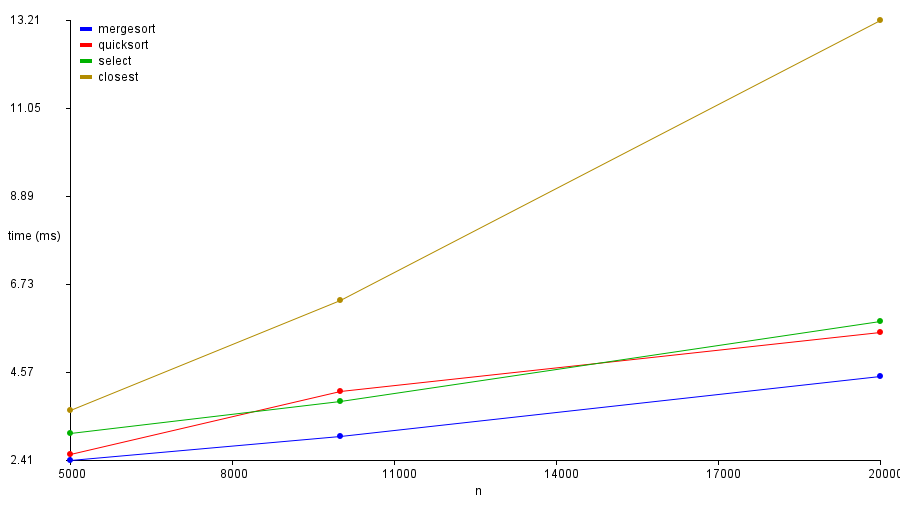
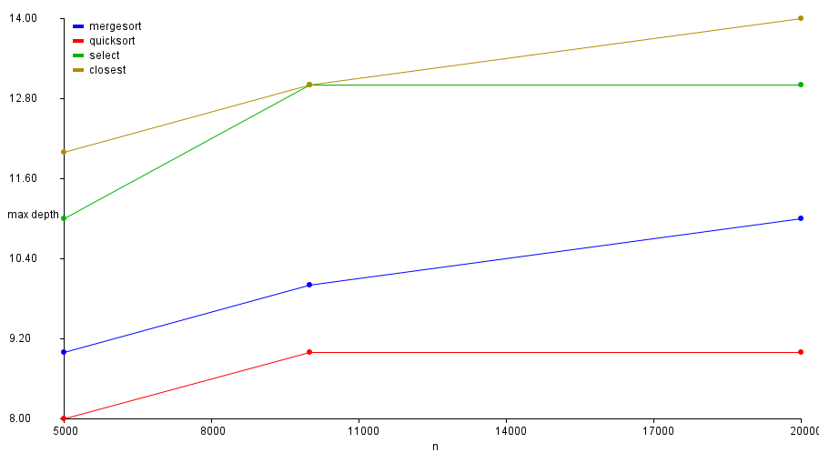

## Report

### Architecture notes (depth / allocations)

- **MergeSort**
    - Top-down; one **reusable buffer `int[] buf`** allocated once at the top level → no per-level allocations.
    - **Insertion-sort cutoff** on small ranges (≤ CUTOFF) reduces recursion depth and copies on tiny runs.
    - Depth is bounded by `⌊log₂ n⌋ + O(1)`; stable, but performs extra moves (copies).

- **QuickSort**
    - **Randomized pivot** to avoid adversarial inputs.
    - **Recurse only into the smaller partition**, the larger one handled iteratively (tail-rec) → stack depth `O(log n)` even in unlucky splits.
    - In-place partitioning (no auxiliary arrays) → low allocation & good cache locality.

- **Select (Median-of-Medians)**
    - Deterministic pivot: groups of 5 → medians → **median of medians**; **3-way partition** (`<`, `==`, `>`) to handle duplicates.
    - Two recurrences per call: a small one on medians (`n/5`) and one on at most `7n/10`.
    - In-place; only temporary variables. Depth `O(log n)`.

- **Closest Pair**
    - Points are sorted by **x** once. Each recursion level maintains **y-order** via a linear merge with a **reusable `Point[] tmp`** buffer.
    - “Strip” around the split line is scanned in y-order; for each point we check ≤ **7** following neighbors (geometric packing bound).
    - Depth `⌊log₂ n⌋ + O(1)`. To minimize GC, the y-merge buffer is reused across levels.

---

### Recurrence analysis (2–6 sentences each)

- **MergeSort.**  
  Recurrence: `T(n) = 2T(n/2) + Θ(n)` (merge is linear). By the **Master Theorem** (case 2), `T(n) = Θ(n log n)`.  
  Stack depth `Θ(log n)`.

- **QuickSort (randomized, recurse-smaller).**  
  Expected recurrence: `E[T(n)] = (2/n) Σ_{k=0}^{n-1} E[T(k)] + Θ(n)` ⇒ `Θ(n log n)`.  
  Worst case `Θ(n²)` exists, but random pivot makes it exponentially unlikely.  
  Recurse-smaller guarantees **stack depth `O(log n)`** even when splits are unbalanced.

- **Select (Median-of-Medians).**  
  With 5-element groups the pivot is ≥30th and ≤70th percentile.  
  Recurrence (worst case): `T(n) ≤ T(n/5) + T(7n/10) + Θ(n)`.  
  By **Akra–Bazzi** (or standard MoM analysis), `T(n) = Θ(n)`. Depth is `O(log n)`.

- **Closest Pair.**  
  Recurrence: `T(n) = 2T(n/2) + Θ(n)` (linear y-merge + strip check with ≤7 neighbors per point).  
  By the **Master Theorem**, `T(n) = Θ(n log n)`.  
  Depth `Θ(log n)`; extra factor mainly from the final strip pass.

---

### Plots

We plot **time vs n** and **depth vs n** from `metrics.csv` produced by the CLI.

1. Generate metrics (example):
   ```bash
   mvn -q -DskipTests exec:java -Dexec.args="--algo all --n 10000 --runs 3 --seed 123 --out metrics.csv"
   mvn -q -DskipTests exec:java -Dexec.args="--algo all --n 20000 --runs 3 --seed 123 --out metrics.csv"
   mvn -q -DskipTests exec:java -Dexec.args="--algo all --n 50000 --runs 3 --seed 123 --out metrics.csv"
## Results



